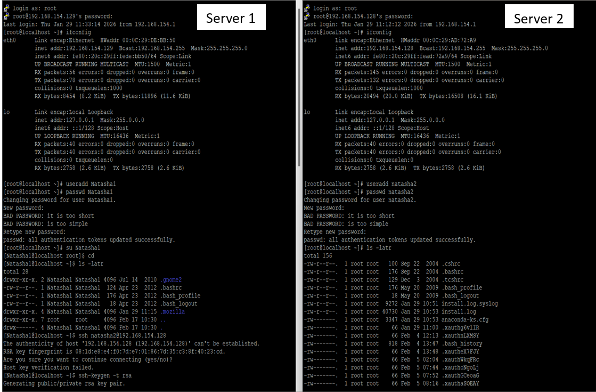
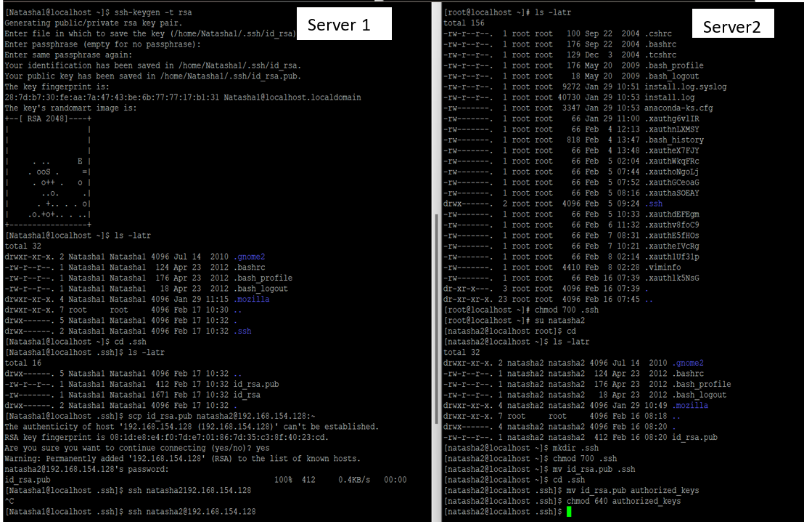
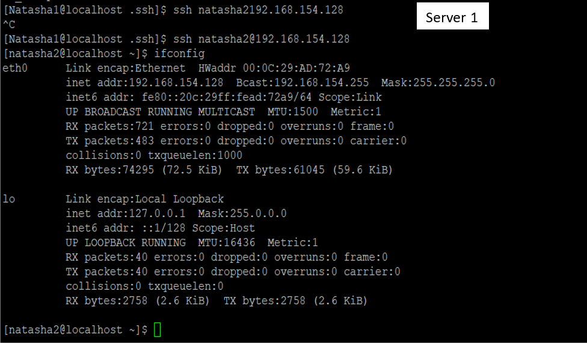

# Linux Administration & AWS Projects

This repository contains documentation and configurations for essential Linux services hosted on AWS EC2 instances.

---

## 🚀 Project 1: FTP Server Configuration (VSFTPD)
**Goal:** Securely share files between a local machine and an AWS EC2 Linux instance.

### Technical Implementation:
* **OS:** Amazon Linux / Ubuntu
* **Service:** `vsftpd` (Very Secure FTP Daemon)
* **AWS:** Configured Security Groups to allow Port 21 and Passive Ports (PASV).
* **Security:** Created a dedicated FTP user with a non-shell login (`/sbin/nologin`) for security.

### Project Screenshots:

*Figure 1: Initializing the VSFTPD service and verifying status.*

*Figure 2: Successful connection via FTP client showing directory listing.*

*Figure 3: Configuration file setup and user permission checks.*

*Figure 4: Successful file upload/download verification.*

---

## 🔐 Project 2: SSH Key-Based Authentication
**Goal:** Replace password-based logins with secure SSH keys for remote server management.

### Technical Implementation:
* **Key Generation:** Used `ssh-keygen` to create RSA/ED25519 key pairs.
* **Distribution:** Used `ssh-copy-id` to transfer the public key to the remote server.
* **Security:** Disabled password authentication in `/etc/ssh/sshd_config` to prevent brute-force attacks.

### Project Screenshots:

*Figure 5: Generating the public/private key pair on the local machine.*

*Figure 6: Authorizing the key on the AWS EC2 instance.*

*Figure 7: Successful login without a password using the secure key.*

---

## 🛠️ Tech Stack
* **Cloud:** AWS (EC2, Security Groups, VPC)
* **Linux:** Amazon Linux / Ubuntu
* **Protocols:** FTP, SFTP, SSH
* **Storage:** LVM, NFS

