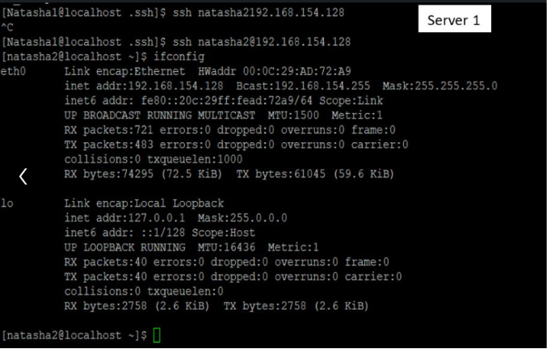

# Linux Administration & AWS Projects

This repository contains documentation and configurations for essential Linux services hosted on AWS EC2 instances.

---

## 🚀 Project 1: [FTP Server Configuration (VSFTPD)](./ftp-server-setup/)
*(Click the title above for the full step-by-step setup guide)*

**Goal:** Securely share files between a local machine and an AWS EC2 Linux instance.

### Technical Implementation:
* **Service:** `vsftpd` (Very Secure FTP Daemon)
* **AWS:** Configured Security Groups for Port 21 and Passive Ports.
* **Security:** Created a dedicated FTP user with a non-shell login.

### Project Screenshots:

*Figure 1: Initializing the VSFTPD service.*

*Figure 2: Successful connection via FTP client.*

*Figure 3: Configuration file verification.*

*Figure 4: File transfer verification.*

---

## 🔐 Project 2: [SSH Key-Based Authentication](./ssh-keygen/)
*(Click the title above for the full security hardening guide)*

**Goal:** Secure remote server management using RSA/ED25519 key pairs instead of passwords.

### Technical Implementation:
* **Key Generation:** Created keys using `ssh-keygen`.
* **Security:** Disabled password-based authentication in `sshd_config`.
* **Access:** Authorized public keys for seamless AWS EC2 login.

### Project Screenshots:

*Figure 5: Generating secure SSH keys.*

*Figure 6: Authorizing the public key on the server.*

*Figure 7: Passwordless login verification.*

*Figure 8: Hardening the SSH configuration.*

---

## 🛠️ Tech Stack
* **Cloud:** AWS (EC2, Security Groups, VPC)
* **Linux:** Amazon Linux / Ubuntu
* **Services:** FTP, SSH, LVM, NFS

