# Linux Administration Projects

This repository showcases a professional portfolio of Linux system administration, network services, and storage management implemented on AWS EC2 infrastructure. Each project demonstrates enterprise-grade server management, security hardening, and storage automation.

---

## 🛠️ Technical Toolkit
* **Cloud Infrastructure:** AWS (EC2, Security Groups, VPC, EBS)
* **Linux Distributions:** RHEL / Amazon Linux / Ubuntu
* **Core Competencies:** Storage Management (LVM), Network Protocols (NFS/FTP), Identity & Security (SSH Hardening), Web Servers (Apache HTTPD)
* **Automation:** Bash Scripting (User Provisioning Automation)

---

## 🚀 Project 1: [ftp-vsftpd-server](./ftp-vsftpd-server/)
*(Click title for full documentation)*

**Goal:** Securely share files between a local machine and an AWS EC2 Linux instance using VSFTPD.

### Project Screenshots:

---

## 🔐 Project 2: [SSH-Security-Hardening](./SSH-Security-Hardening/)
*(Click title for full documentation)*

**Goal:** Harden server security by implementing RSA/ED25519 key-based authentication and disabling password logins.

### Project Deployment Steps & Screenshots:

#### Phase 1: Cryptographic Key Generation
* **Asymmetric Key Pair Provisioning (`ssh-keygen -t rsa`)**
  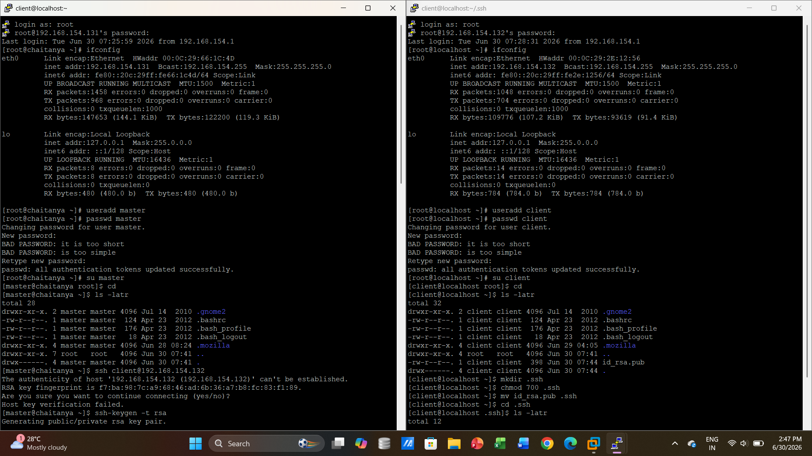

#### Phase 2: Remote Node Provisioning & Security Overlays
* **Target User Setup & Secure Key Distribution via `scp`**
  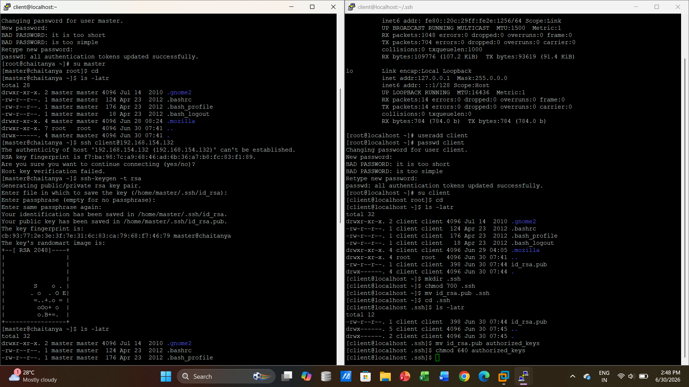

#### Phase 3: Infrastructure Validation & Authentication Auditing
* **Establishing Passwordless Access & Identity Verification (`ifconfig` Auditing)**
  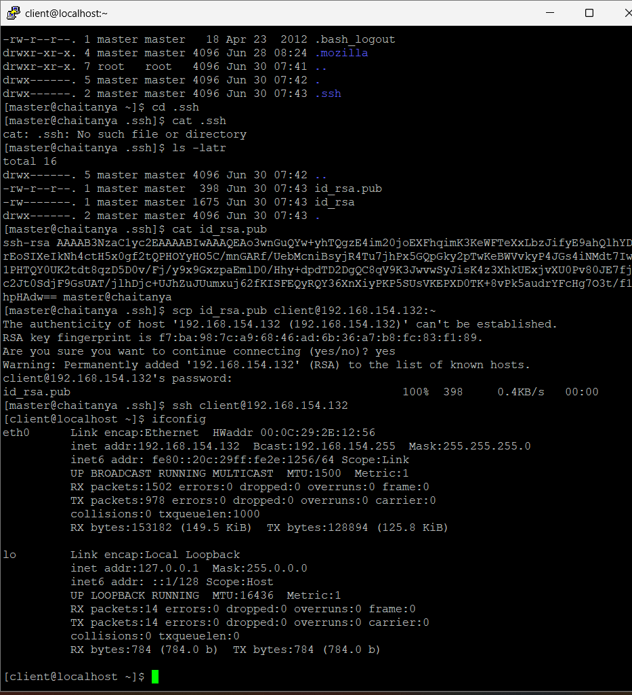

---

## 📂 Project 3: [NFS-Network-Sharing](./NFS-Network-Sharing/)
*(Click title for full documentation)*

**Goal:** Configure centralized, shared network storage between multiple Linux nodes within a VPC.

### Project Screenshots:

---

## 💽 Project 4: [LVM-Storage-Management](./LVM-Storage-Management/)
*(Click title for full documentation)*

**Goal:** Implement Logical Volume Management to pool physical disks and allow zero-downtime, flexible storage scaling.

### Project Deployment Steps & Screenshots:

#### Phase 1: Disk Partitioning & Verification
* **Initial Storage Layout & Volume Discovery (`fdisk -l` / `lsblk`)**
  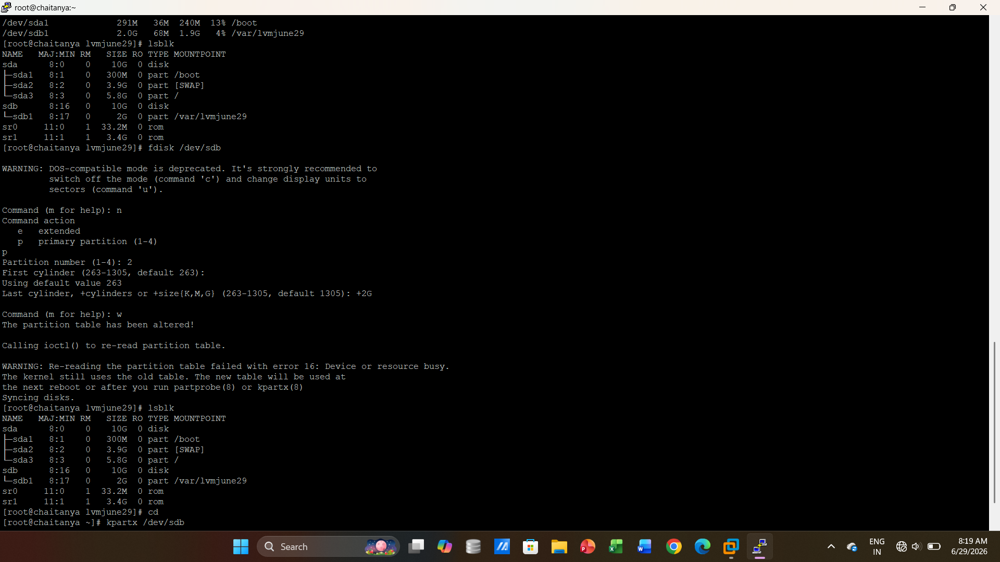
* **Creating Standard Primary Partitions using `fdisk`**
  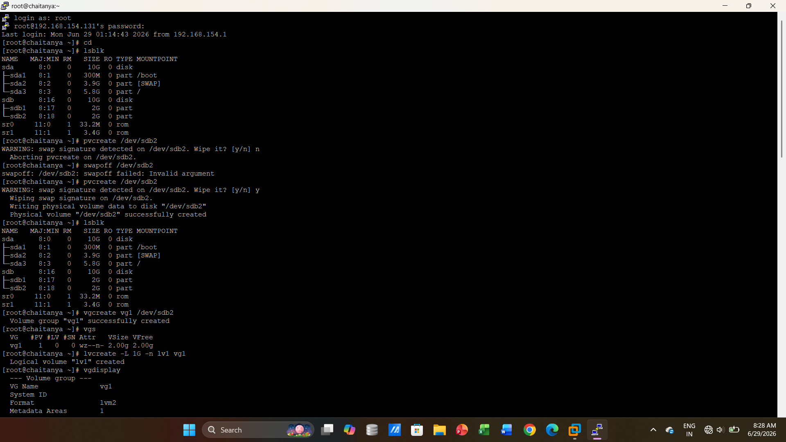
* **Formatting Partitions & Managing Busy Partition Tables with `kpartx`**
  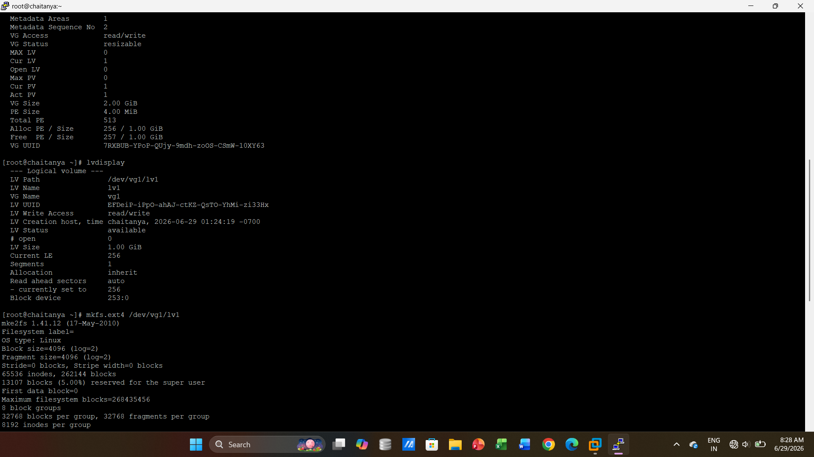

#### Phase 2: Building the LVM Architecture
* **Initializing Local File Systems and Testing Mount points**
  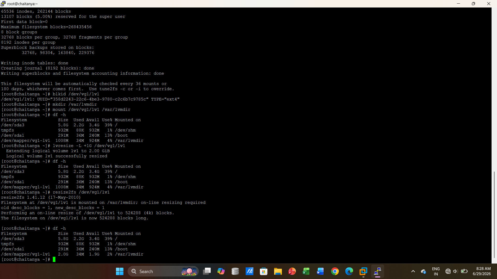
* **Partition Table Synchronization and Secondary Boundary Creation**
  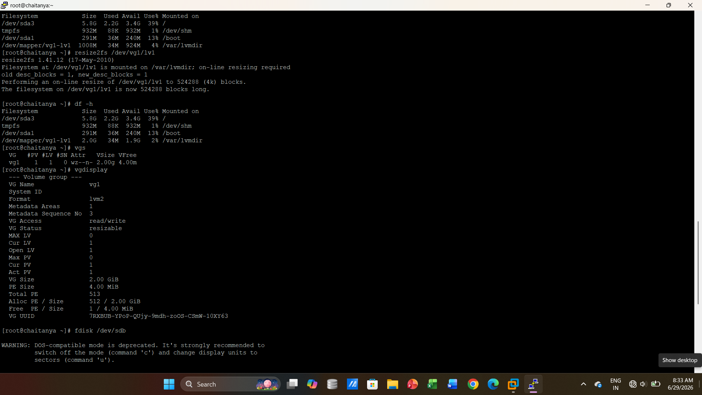
* **Handling Swap Signatures and Setting Up Initial Volume Groups (`vgcreate`)**
  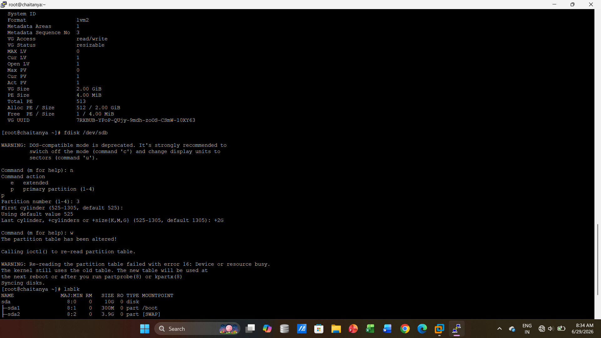

#### Phase 3: Dynamic Scaling & Live Expansion
* **Creating Physical Volumes (`pvcreate`) and Provisioning Logical Volumes (`lvcreate`)**
  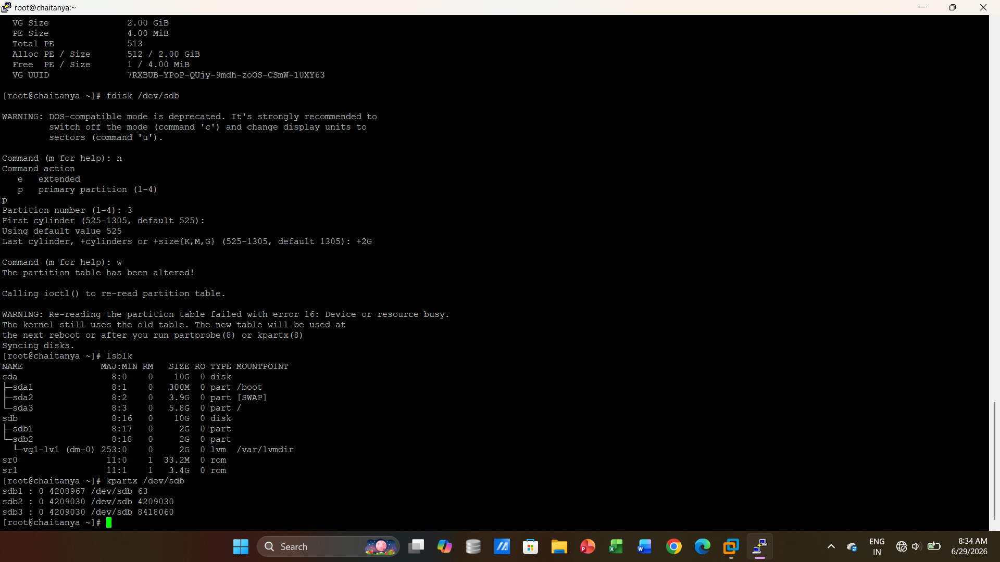
* **Analyzing Logical Volume Metadata via `lvdisplay` and Setting `ext4` Blueprints**
  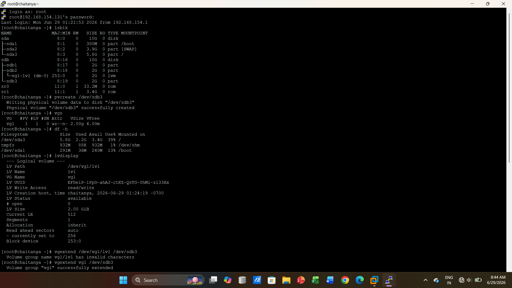
* **Live File System Expansion (`lvresize` & Online `resize2fs` Allocation)**
  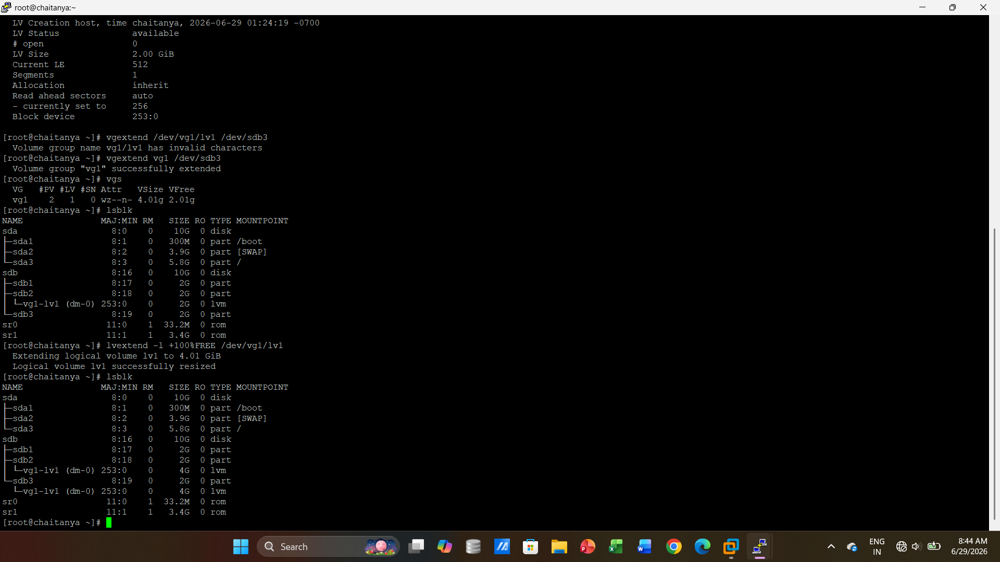

---

## 👤 Author
**Chaitanya Chintappanavar**  
*Linux Administrator & Cloud Enthusiast*  
[LinkedIn Profile](https://www.linkedin.com/in/chaitanyabc)

*Open to entry-level opportunities in Linux Systems Administration, Cloud Support, or Junior DevOps roles in the Bengaluru area.*
